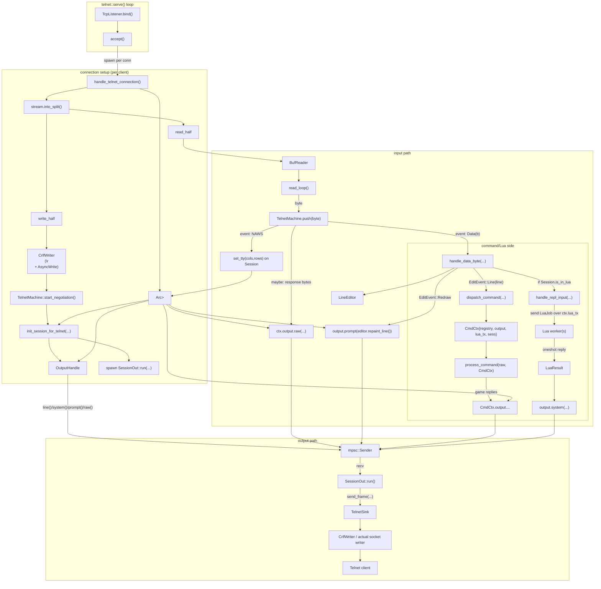

```mermaid

flowchart TD

    subgraph TELNET_SERVER["telnet::serve() loop"]
        L["TcpListener.bind()"] --> A["accept()"]
    end

    A -->|spawn per conn| HC["handle_telnet_connection()"]

    subgraph CONN_SETUP["connection setup (per client)"]
        HC --> S1["stream.into_split()"]
        S1 --> W[write_half]
        S1 --> R[read_half]

        W --> CW["CrlfWriter<br/>(\r\n + AsyncWrite)"]
        CW --> TMN["TelnetMachine::start_negotiation()"]
        
        HC --> SES["Arc<RwLock<Session::new(Telnet)>>"]

        TMN --> IO["init_session_for_telnet(...)"]
        IO --> OH[OutputHandle]
        IO --> BG["spawn SessionOut::run(...)"]
    end

    subgraph OUTPUT_PIPE["output path"]
        OH -->|"line()/system()/prompt()/raw()" | OTX[mpsc::Sender<OutEvent>]
        OTX -->|recv| SO["SessionOut::run()"]
        SO -->|"send_frame(...)"| SINK[TelnetSink]
        SINK --> CW2[CrlfWriter / actual socket writer]
        CW2 --> CLIENT[Telnet client]
    end

    subgraph INPUT_PIPE["input path"]
        R --> RL[BufReader<OwnedReadHalf>]
        RL --> LOOP["read_loop()"]
        LOOP -->|byte| TMS["TelnetMachine.push(byte)"]

        TMS -->|maybe: response bytes| OH2["ctx.output.raw(...)"]
        OH2 --> OTX

        TMS -->|"event: Data(b)"| HD["handle_data_byte(...)"]
        TMS -->|event: NAWS| NAWS["set_tty(cols,rows) on Session"]

        HD --> LED[LineEditor]
        HD -->|EditEvent::Redraw| OH3["output.prompt(editor.repaint_line())"]
        OH3 --> OTX

        HD -->|"EditEvent::Line(line)"| DISPATCH["dispatch_command(...)"]

        subgraph CMD_PATH["command/Lua side"]
            DISPATCH --> CCtx["CmdCtx{registry, output, lua_tx, sess}"]
            CCtx --> PROC["process_command(raw, CmdCtx)"]
            PROC -->|game replies| OH4[CmdCtx.output....]
            OH4 --> OTX

            %% Lua REPL branch
            HD -->|if Session.is_in_lua| REPL["handle_repl_input(...)"]
            REPL -->|send LuaJob over ctx.lua_tx| LUA["Lua worker(s)"]
            LUA -->|oneshot reply| REPLRET[LuaResult]
            REPLRET --> OH5["output.system(...)"]
            OH5 --> OTX
        end
    end

    %% session used by output rendering
    SES --> OH
    SES --> OH2
    SES --> OH3
    SES --> OH4
    SES --> IO
    NAWS --> SES
    
```